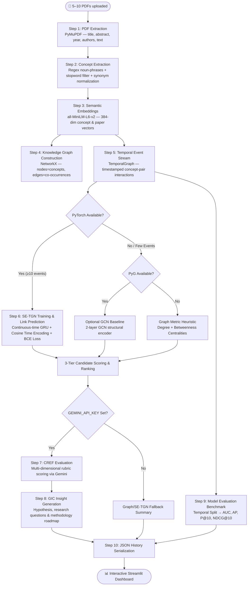

# PaperGraph — AI Research Discovery System

> A synergistic **Temporal Graph Neural Network (SE-TGN) + LLM** framework that uncovers potentially underexplored scientific insights and predicts future concept connections from research papers.

[](https://python.org)
[](https://streamlit.io)
[](https://pytorch.org)
[](https://networkx.org)
[]()

---

## ⚠️ Academic Disclaimer

> This system identifies **potentially interesting relationships** within the uploaded research papers. It does **not** claim to prove that a relationship is experimentally validated. Results are exploratory and designed to assist human researchers in discovering novel cross-domain hypotheses.

---

## 📋 Overview

PaperGraph implements the core methodology from the research paper:

> *"Uncovering novel scientific insights with a synergistic GNN-LLM framework"*  
> **Knowledge-Based Systems, 2025**

The system combines:
1. **Semantic-Enhanced Temporal Graph Networks (SE-TGN):** Dynamic concept co-occurrence modeling across publication timelines with continuous-time GRU memory updates and sinusoidal time encodings.
2. **Concept Relationship Evaluation Framework (CREF):** LLM-based multi-dimensional scoring (Novelty, Impact, Plausibility, Interdisciplinarity).
3. **Generative Insight Creation (GIC):** Automated formulation of research directions, hypotheses, and experimental validation roadmaps.
4. **Formal Baseline Evaluation:** Quantitative benchmark comparing Random, Static Graph, GCN, and SE-TGN using AUC, AP, Precision@10, and NDCG@10.

---

## 🏗️ Architecture & Pipeline



---

## 📊 Methodology Comparison

| Feature | Base Paper (Full KBS 2025) | PaperGraph (This Implementation) |
|---|---|---|
| **Temporal Model** | SE-TGN (TGN + Semantic message passing) | Full SE-TGN (`NodeMemory` GRU + `TimeEncode`) |
| **Temporal Representation** | Continuous timestamped co-occurrence stream | Year-timestamped `TemporalEvent` stream |
| **Candidate Scoring** | $0.50 \times \text{SETGN} + 0.30 \times \text{Graph} + 0.20 \times \text{Semantic}$ | Exact 3-tier scoring formula matching base paper |
| **LLM Reasoning** | CREF (rubric evaluation) + GIC (insight generation) | Gemini 2.5 / 3.6 Flash (CREF + GIC prompts) |
| **Quantitative Evaluation** | AUC, AP, P@K, NDCG@K on held-out test years | `scikit-learn` engine comparing Random, Graph, GCN, SE-TGN |
| **Input Scale** | Tens of thousands of papers corpus | 5–10 user-uploaded PDF batch with year inspector |
| **Execution Environment** | High-performance multi-GPU cluster | Runs efficiently on local CPU / laptop in seconds |

---

## 🚀 Quick Start

### 1. Navigate to the project directory

```bash
cd research_discovery
```

### 2. Activate virtual environment or install dependencies

```bash
# Activate existing venv (if available)
..\.venv\Scripts\Activate.ps1

# Or install from requirements.txt
pip install -r requirements.txt
```

> **For SE-TGN and GCN Acceleration:**
> ```bash
> pip install torch --index-url https://download.pytorch.org/whl/cpu
> pip install torch-geometric scikit-learn
> ```

### 3. Set up your Gemini API Key

Create a `.env` file inside `research_discovery/`:

```env
GEMINI_API_KEY=your_gemini_api_key_here
```

### 4. Launch the Streamlit application

```bash
streamlit run app.py
```

Open [http://localhost:8501](http://localhost:8501) in your browser.

---

## 🧪 Testing

PaperGraph includes a comprehensive unit test suite covering temporal event streams, memory modules, baseline evaluators, PDF processors, and history serialization:

```bash
python -m pytest tests/ -v
```

```
============================= 93 passed in 11.2s =============================
```

---

## 📁 Repository Structure

```
research_discovery/
├── app.py                          # Streamlit application UI & visualization
├── requirements.txt                # Core & optional dependencies
├── .env.example                    # Environment variable template
├── services/
│   ├── pdf_processor.py            # PDF text & metadata extraction + year pre-detection
│   ├── concept_extractor.py        # Regex noun phrase concept extraction & normalization
│   ├── embeddings.py               # all-MiniLM-L6-v2 concept & paper embeddings
│   ├── graph_builder.py            # NetworkX knowledge graph builder
│   ├── temporal_graph.py           # TemporalEvent stream & chronological split engine
│   ├── se_tgn.py                   # PyTorch SE-TGN (NodeMemory, TimeEncode, Link Prediction)
│   ├── gnn_model.py                # Optional PyG GCN baseline encoder
│   ├── graph_analyzer.py           # Multi-factor candidate scoring & ranking
│   ├── llm_service.py              # Gemini LLM integration for CREF & GIC
│   ├── evaluator.py                # Formal metrics (AUC, AP, P@10, NDCG@10) & baselines
│   ├── analysis_pipeline.py        # 10-stage orchestration pipeline
│   └── history_service.py          # JSON result persistence & retrieval
├── tests/
│   ├── test_temporal_graph.py      # TemporalGraph & chronological split tests
│   ├── test_se_tgn.py              # SE-TGN model forward pass, memory & loss tests
│   ├── test_evaluator.py           # Metric calculation (AUC/AP/P@K/NDCG) tests
│   ├── test_graph_builder.py       # Graph construction & centrality tests
│   ├── test_pdf_processor.py       # PDF parsing & year regex tests
│   └── test_history.py             # History round-trip serialization tests
└── data/
    └── history/                    # Persisted analysis records (*.json)
```

---

## 💡 Key UI Tabs

1. **Overview:** High-level summary of papers, concepts, edges, and active pipeline badges.
2. **Knowledge Graph:** Interactive 2D spring-layout NetworkX co-occurrence graph.
3. **⏱️ Temporal Graph:** Temporal event timeline, events-per-year histogram, and train/val/test split stats.
4. **Candidate Connections:** Ranked table of underexplored concept pairs with component score breakdowns.
5. **Insight Report:** Deep-dive CREF rubric scores and GIC research hypothesis generated by Gemini.
6. **📈 Model Evaluation:** Comparative benchmark table reporting AUC, AP, P@10, and NDCG@10 across models.
