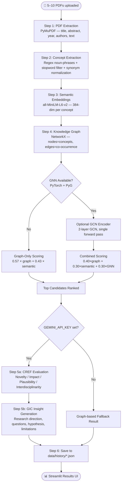

# PaperGraph — AI Research Discovery System

> A simplified B.Tech research tool that discovers potentially underexplored concept connections from uploaded research papers using lightweight graph analysis, semantic embeddings, and LLM-powered insight generation.

[](https://python.org)
[](https://streamlit.io)
[](https://networkx.org)
[]()

---

## ⚠️ Academic Disclaimer

> This system identifies **potentially interesting relationships** within the uploaded research papers. It does **not** prove that a relationship is scientifically novel or that the generated research direction is experimentally validated. Results are exploratory and should be reviewed by domain experts.

---

## 📋 Overview

PaperGraph is a simplified B.Tech project **inspired by** (but not a reproduction of) the GNN-LLM framework described in:

> *"Uncovering novel scientific insights with a synergistic GNN-LLM framework"*  
> Knowledge-Based Systems, 2025

### How This Project Differs from the Base Paper

| Component | Base Paper (SE-TGN/CREF/GIC) | PaperGraph (This Project) |
|---|---|---|
| Input | Tens of thousands of timestamped papers | 5–10 user-uploaded PDFs |
| Graph model | Trained Temporal Graph Network (SE-TGN) | NetworkX metrics + optional lightweight GCN |
| Data over time | Multi-year co-occurrence event streams | Single-snapshot co-occurrence graph |
| LLM re-ranking | CREF: top-N of thousands of candidates | CREF-style: top 3 candidates |
| Insight generation | GIC: full research insight reports | Same output shape, top candidate |
| Validation | AUC/AP/P@K/NDCG@K on held-out future links | **No formal validation** |

---

## 🔄 Pipeline Architecture



---

## 🚀 Quick Start

### 1. Clone or navigate to the project

```bash
cd research_discovery
```

### 2. Install dependencies

```bash
pip install -r requirements.txt
```

> **Optional GNN support** (adds ~1.5 GB for PyTorch):
> ```bash
> pip install torch torch-geometric
> ```

### 3. Configure environment

```bash
cp .env.example .env
# Edit .env and add your GEMINI_API_KEY (optional but recommended for LLM stages)
```

### 4. Run the app

```bash
streamlit run app.py
```

Open [http://localhost:8501](http://localhost:8501) in your browser.

---

## 🔧 Environment Variables

| Variable | Required | Default | Description |
|---|---|---|---|
| `GEMINI_API_KEY` | Optional | — | Enables CREF evaluation + GIC insight generation via Gemini |
| `GEMINI_MODEL` | Optional | `gemini-1.5-flash` | Override the Gemini model |

Get a free Gemini API key at [https://aistudio.google.com/app/apikey](https://aistudio.google.com/app/apikey).

---

## 📥 Input

- **5–10 PDF files** containing research papers
- Standard digital PDFs with extractable text (not scanned/image PDFs)
- No maximum file size enforced, but very large PDFs will be slower
- Duplicate papers are allowed but may reduce concept diversity

---

## ⚙️ Pipeline Details

### Step 1 — PDF Extraction (`services/pdf_processor.py`)
Uses `PyMuPDF` (`fitz`) to extract:
- **Title**: from PDF metadata → first substantial text line → filename
- **Abstract**: regex search for "Abstract" section → first paragraph
- **Year**: from PDF metadata dates → most frequent 4-digit year in text
- **Authors**: from PDF metadata `author` field → text heuristics
- **Full text**: all pages concatenated (used only during analysis, not persisted)

### Step 2 — Concept Extraction (`services/concept_extractor.py`)
- Regex-based noun phrase extraction (no NLTK/spaCy required)
- Filters against `ACADEMIC_STOPWORDS` (150+ generic academic terms)
- Normalizes synonyms: `"GNN"` → `"Graph Neural Network"`, `"ML"` → `"Machine Learning"`, etc.
- Frequency threshold: concept must appear in ≥ 1 paper (configurable)
- Keeps top 80 concepts by cross-paper frequency

### Step 3 — Embeddings (`services/embeddings.py`)
- `all-MiniLM-L6-v2` (384-dim, Apache 2.0 license)
- Encodes title + abstract per paper and each concept string
- In-memory only — no vector DB, no disk persistence
- Graceful fallback: if `sentence-transformers` unavailable, semantic similarity = 0

### Step 4 — Knowledge Graph (`services/graph_builder.py`)
- Nodes = unique canonical concept strings
- Edges = co-occurrence within the same paper
- Edge attributes: `weight` (shared-paper count), `supporting_papers` (list of paper IDs)

### Step 5 — Graph Analysis + Optional GNN (`services/graph_analyzer.py`, `gnn_model.py`)

**Graph score components:**
```
graph_score = 0.45 × centrality_score + 0.30 × bridge_score + 0.25 × novelty_bonus

where:
  centrality_score = mean(degree_centrality_A, degree_centrality_B)
  bridge_score     = max(betweenness_A, betweenness_B)
  novelty_bonus    = 1 - (edge_weight / max_edge_weight)   [1.0 if no direct edge]
```

**Combined candidate score formula:**
```
# When GNN is ACTIVE (PyTorch + PyG installed, graph ≥ 4 nodes):
candidate_score = 0.40 × graph_score + 0.30 × semantic_similarity + 0.30 × gnn_score

# When GNN is INACTIVE (fallback):
candidate_score = 0.57 × graph_score + 0.43 × semantic_similarity
```

**GNN component (optional):**
- 2-layer GCN with randomly initialized weights
- Node features: `[degree_norm, betweenness_norm, freq_norm, embedding_dims[:8]]`
- Single forward pass — no training, no offline learning
- Output: normalized pairwise cosine similarities used as `gnn_score`

### Step 6 — LLM Evaluation (CREF-style, `services/llm_service.py`)
For top 3 candidates:
- Scores on 4 dimensions (1–5 each): `novelty`, `impact`, `plausibility`, `interdisciplinarity`
- Returns strict JSON (code-fence-aware extraction with fallback)
- Always uses hedged language: "potentially underexplored within the uploaded papers"
- 2 retries with 2s delay on API failure

### Step 7 — Insight Generation (GIC-style)
For the top CREF-scored candidate:
- `research_direction`, `explanation`, `research_questions` (3×), `hypothesis`, `limitations`
- Clearly separates paper-based evidence from model-generated speculation

---

## 📤 Output

### History JSON Schema
```json
{
  "analysis_id": "analysis_20260821_101530",
  "created_at": "2026-08-21T10:15:30",
  "paper_count": 7,
  "papers": [
    {
      "paper_id": "paper_001",
      "filename": "paper1.pdf",
      "title": "...",
      "year": 2024,
      "concepts": ["GNN", "Healthcare"]
    }
  ],
  "concept_count": 23,
  "relationship_count": 41,
  "graph_summary": {"node_count": 23, "edge_count": 41, "density": 0.157},
  "analysis_mode": "Lightweight GNN-based Graph Analysis",
  "candidates": [
    {"connection": "GNN + LLM", "graph_score": 0.87, "candidate_score": 0.76}
  ],
  "final_result": {
    "connection": "GNN + LLM",
    "novelty": 4,
    "impact": 5,
    "plausibility": 4,
    "interdisciplinarity": 5,
    "research_direction": "...",
    "explanation": "...",
    "research_questions": ["...", "...", "..."],
    "hypothesis": "...",
    "supporting_papers": ["paper_001", "paper_004"],
    "limitations": "..."
  },
  "llm_available": true,
  "warnings": []
}
```

> **Note:** `full_text` is never persisted. Only metadata, concepts, scores, and insights are stored.

---

## 📁 Project Structure

```
research_discovery/
├── app.py                    # Streamlit multi-page UI
├── requirements.txt          # Python dependencies
├── .env.example              # Environment variable template
├── README.md                 # This file
├── data/
│   └── history/              # JSON analysis history files
├── services/
│   ├── __init__.py
│   ├── pdf_processor.py      # PyMuPDF extraction
│   ├── concept_extractor.py  # Noun-phrase extraction + normalization
│   ├── embeddings.py         # sentence-transformers (all-MiniLM-L6-v2)
│   ├── graph_builder.py      # NetworkX co-occurrence graph
│   ├── graph_analyzer.py     # Centrality scoring + candidate ranking
│   ├── gnn_model.py          # Optional 2-layer GCN encoder (PyG)
│   ├── llm_service.py        # Gemini CREF + GIC prompt chains
│   ├── history_service.py    # JSON history save/load/list
│   └── analysis_pipeline.py  # Pipeline orchestrator
├── models/
│   └── README.md             # Why no model weights are stored here
├── utils/
│   ├── __init__.py
│   ├── text_utils.py         # Stopwords, synonym map, noun-phrase regex
│   └── json_utils.py         # Safe JSON I/O, LLM response JSON extractor
└── tests/
    ├── test_pdf_processor.py
    ├── test_graph_builder.py
    └── test_history.py
```

---

## 🧪 Running Tests

```bash
cd research_discovery
pytest tests/ -v
```

---

## ⚖️ Limitations

1. **No validation**: Unlike the base paper (AUC/AP/P@K/NDCG@K), this system has no formal evaluation against future links. All results are exploratory.
2. **Tiny corpus**: 5–10 papers is far too small for statistically meaningful graph patterns. The base paper uses thousands.
3. **No temporal modeling**: No multi-year event streams, no temporal GNN memory.
4. **Concept extraction quality**: Regex-based; may miss domain-specific terms or over-include noise.
5. **LLM hallucination**: Gemini may generate plausible-sounding but incorrect information. Always verify outputs with domain experts.
6. **Scanned PDFs**: OCR is not supported. Papers must have extractable text layers.

---

## 🔮 Future Improvements

- [ ] Optional spaCy NER for higher-quality concept extraction
- [ ] Fine-tuned sentence encoder on scientific abstracts (e.g., SciBERT)
- [ ] Support for uploading `.bib` / `.ris` reference lists alongside PDFs
- [ ] Interactive graph exploration (click node → see papers mentioning it)
- [ ] Citation graph overlay (if DOIs are extractable)
- [ ] Multi-paper comparison view
- [ ] Export results to PDF report
- [ ] Support for additional LLM providers (OpenAI, Anthropic)

---

## 📚 Reference

The simplified components in this system are inspired by:

> *"Uncovering novel scientific insights with a synergistic GNN-LLM framework"*  
> Knowledge-Based Systems, 2025.

This project is an independent B.Tech academic exercise and is **not affiliated with, endorsed by, or a reproduction of** the above work.
